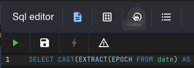

# RailsSpotlight

Chrome extension [Rails Spotlight](https://chrome.google.com/webstore/detail/rails-spotlight/kfacifkandemkdemkliponofajohhnbp?hl=en-US).

## Support for

* Rails 6+
* Ruby 3.1+

## Installation

Add this line to your application's Gemfile:

use bash

```bash
bundle add rails_spotlight --group development
```

or add it manually:

```ruby
group :development do
  gem 'rails_spotlight'
end
```

## Using gems locally with Gemfile.local (No Git Pollution)

This guide shows you how to use any gem **locally in development** without modifying your app’s main `Gemfile`. It’s perfect for plugin development, debugging, or testing gems privately.

The setup also works with **`puma-dev`** out of the box and ensures your local changes stay out of Git.

---

###  1. Add a bundle Wrapper to Your Shell

Paste this function into your `~/.zshrc`, `~/.bashrc`, or `~/.profile`:

```bash
bundle() {
  local gemfile_local="Gemfile.local"
  local lockfile_local="Gemfile.local.lock"
  local lockfile_default="Gemfile.lock"

  if [[ "$1" == "install" ]]; then
    echo "[bundle] Running standard install with Gemfile"
    command bundle install "${@:2}"

    if [ -f "$gemfile_local" ]; then
      echo "[bundle] Removing $lockfile_local if it exists"
      rm -f "$lockfile_local"

      echo "[bundle] Running install with Gemfile.local"
      BUNDLE_GEMFILE="$gemfile_local" command bundle install "${@:2}"
    fi
  else
    if [ -f "$gemfile_local" ]; then
      BUNDLE_GEMFILE="$gemfile_local" command bundle "$@"
    else
      command bundle "$@"
    fi
  fi
}
```

### 2. Add the setup script

Paste this function into your `~/.zshrc`, `~/.bashrc`, or `~/.profile`:
```bash
setup_local_gemfile() {
  echo 'export BUNDLE_GEMFILE=Gemfile.local' > .pumaenv

  cat > Gemfile.local <<'RUBY'
gemfile = File.join(File.dirname(__FILE__), 'Gemfile')
if File.readable?(gemfile)
  puts "Loading #{gemfile}..." if $DEBUG
  instance_eval(File.read(gemfile))
end
RUBY

  {
    echo .pumaenv
    echo Gemfile.local
    echo Gemfile.local.lock
  } >> .git/info/exclude

  echo "[setup] Local Gemfile environment ready!"
}
```

### 3. Go to your app folder modify Gemfile.local

Just add your gem like this 

```ruby
group :development do
  gem 'rails_spotlight'
end
```

### 4. Install all and restart puma.dev if needed
```bash
# if you didn't reload you bash/zsh just load rc or profile file here by source {my_file}
setup_local_gemfile
bundle install
puma-dev -stop
```


## Configuration

Generate configuration file by running:

```bash
rails rails_spotlight:generate_config 
```

file will be created in `config/rails_spotlight.yml`

### Configuration options

```yaml
  ENABLED: true
  # Default configuration for RailsSpotlight
  PROJECT_NAME: <%=Rails.application.class.respond_to?(:module_parent_name) ? Rails.application.class.module_parent_name : Rails.application.class.parent_name%>
  SOURCE_PATH: <%=Rails.root%>
  STORAGE_PATH: <%=Rails.root.join('tmp', 'data', 'rails_spotlight')%>
  STORAGE_POOL_SIZE: 20
  LOGGER: <%=Logger.new(Rails.root.join('log', 'rails_spotlight.log'))%>
  
  # Security configuration
  DATA_ACCESS_TOKEN: # prevent from unauthorized access to the data
  RAILS_SPOTLIGHT_PROJECT:
  
  # Prevent from processing and sending some data to the extension
  MIDDLEWARE_SKIPPED_PATHS: []
  NOT_ENCODABLE_EVENT_VALUES:
  SKIP_RENDERED_IVARS: []
  
  # Features
  FILE_MANAGER_ENABLED: true
  RUBOCOP_ENABLED: true
  SQL_CONSOLE_ENABLED: true
  IRB_CONSOLE_ENABLED: true
  
  # File manager configuration
  BLOCK_EDITING_FILES: false
  BLOCK_EDITING_FILES_OUTSIDE_OF_THE_PROJECT: true
  DIRECTORY_INDEX_IGNORE: ['/.git', '**/*.lock', '**/.DS_Store', '/app/assets/images/**', '/app/assets/fonts/**', '/app/assets/builds/**']
  
  # Rubocop configuration
  RUBOCOP_CONFIG_PATH: '.rubocop.yml'
  
  # Workarounds of CSP restrictions for form JS execution from the extension
  FORM_JS_EXECUTION_TOKEN: <%= Digest::MD5.hexdigest(Rails.application.class.respond_to?(:module_parent_name) ? Rails.application.class.module_parent_name : Rails.application.class.parent_name)%>
  
  # Required for all action cable features
  USE_CABLE: false
  
  # Rest of the configuration is required for ActionCable. It will be disabled automatically in when ActionCable is not available.
  AUTO_MOUNT_CABLE: false
  CABLE_MOUNT_PATH: /cable
  
  # Experimental feature.
  CABLE_LOGS_ENABLED: false
  DEFAULT_RS_SRC: default
  
  CABLE_CONSOLE_ENABLED: false
  
  REQUEST_COMPLETED_BROADCAST_ENABLED: false
```

## Additional metrics

To enable additional rendering metrics like local variables, instance variables, params etc. add to your layout file:

```erb
<% if Rails.env.development? && defined?(::RailsSpotlight)%>
  <%= RailsSpotlight::RenderViewReporter.report_rendered_view_locals(self, locals: local_assigns, params: params, skip_vars: %i[current_template], metadata: { just_test: 'Works' }) %>
<% end %>
```

## Experimental features
Live logs requires action cable to be enabled. 

USE_CABLE: true
CABLE_LOGS_ENABLED: true

When you want to use different sources for the cable logs you need to update `cable.yml` file. 

```yaml
development:
  adapter: redis
  url: redis://localhost:6379/1
```
**Note:** Redis is required for live logs. so just add it to your Gemfile and run `bundle install`

modify yor `development.rb` file 

```ruby
config.action_cable.allowed_request_origins = ['chrome-extension://chjfnpmbgdbipfogflkhleaceacndaop' ]
```

Now just run your servers with environment variable RS_SRC=my_source_name
like `RS_SRC=sidekiq bundle exec sidekiq -C config/sidekiq.yml`
or `RS_SRC=web bundle exec puma -C config/puma.rb`

---

Forms (Filling forms with scenarios)

To be able use full potential of the forms you need to generate partial that helps with js code injection.

Just use `rails rails_spotlight:inject_js_partial` and inject partial to your layout file as instructed in past generation message.
setup your `FORM_JS_EXECUTION_TOKEN` or use pregnerated one in your extension settings.

# Advanced log configuration 
You can add to your Initializers `config/initializers/rails_spotlight.rb` file with the additional configuration for the logger.

```ruby
  unless Rails.env.production?
    # Publish logs to the spotlight (only when implementation is based on the Rails.logger)
    defined?(Logger) && Logger&.extend(RailsSpotlight::LogInterceptor)
    # Publish Hutch logs to the spotlight
    defined?(Hutch::Logging) && Hutch::Logging.logger&.extend(RailsSpotlight::LogInterceptor)
  end
```

## Troubleshooting

Known issue:

Authentication error when using: 
  - Specific authentication method and action cable
  - AUTO_MOUNT_CABLE: true

Solution:
  - Set AUTO_MOUNT_CABLE: false
  - Add manually `mount ActionCable.server => '/cable'` to `config/routes.rb` with proper authentication method

---

Requests crash when **ActionCable settings** -> **Use action cable for meta requests (required for Safari)**  is on

Solution:
  - Switch flag off
  - REQUEST_COMPLETED_BROADCAST_ENABLED: false

---

SQL manager query execution freeze

It may happen in rail 8

Solution:
  - Use `Execute query with write access toggle` to skip transactional/cancellable execution -> 

## Testing

To run tests for all versions of Rails and Ruby, run:

```bash
docker-compose up
```

## Usage

Gem is created for the Chrome extension [Rails Spotlight](https://chrome.google.com/webstore/detail/rails-spotlight/kfacifkandemkdemkliponofajohhnbp?hl=en-US), but it can be used for any purpose.

## License

The gem is available as open source under the terms of the [MIT License](https://opensource.org/licenses/MIT).

